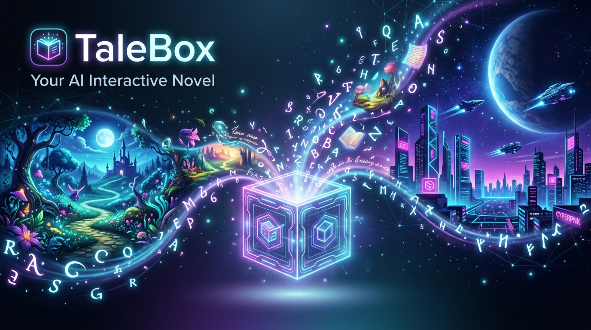

# TaleBox 📖✨



> **打破阅读次元壁 —— 你的 AI 驱动沉浸式互动小说世界**

TaleBox 是一款**将小说解构为互动世界**的 AI 驱动沉浸式平台。在 TaleBox 中，传统的静态文字被转化为可感知、可对话、可抉择的动态剧情。无论是本地 txt 小说还是你脑海中的灵感，TaleBox 都能赋予其全新的 3D 互动生命力。

---

## ⚡ 快速部署启动

只需三步，即可本地开启您的互动文学世界：

```bash
# 1. 克隆项目并复制环境变量
git clone https://github.com/komeadanagito/TaleBox.git && cd TaleBox
cp .env.example .env  # 编辑并填入您的 LLM API Key 与数据库配置

# 2. 安装依赖并启动开发服务
npm install
npm run dev
```
打开浏览器访问 `http://localhost:3000` 即可体验。

---

## 🌟 核心产品体验

### 📖 智能小说解构 (Novel Deconstruction)
导入你喜欢的本地 TXT 小说，TaleBox 会自动进行深度解析。从章节划分、场景提取，到角色性格档案和人际关系网构建，AI 将整部小说无缝转换为沉浸式互动剧本。

### 🎮 3D 沉浸式阅读与交互游玩 (3D Interactive Play)
进入特制的互动阅读房间：
- **纸质书写实翻页效果**：通过精致的 Page-turning 动画保留纸质书的阅读温感。
- **互动抉择**：在关键分歧点做出选择，剧情随你的意志实时改写。
- **仪式感反馈**：章节完成的华丽通关动效，以及充满史诗感的结局结算面板。

### 📚 3D 互动立体书架 (3D Interactive Bookshelf)
基于 **Three.js** 与 **React Three Fiber** 构建的 3D 三维书架，展示你所有导入的小说与创作作品。精致的翻转、选中动画与书脊纹理设计，让虚拟藏书也拥有真实的质感。

### 💬 跨次元角色共情对话 (Empathetic Dialogue)
突破字里行间的隔阂，直接与书中人物发起实时对话。人物拥有基于小说设定的长期记忆与动态情感，他们的反馈会对剧情走向产生真实的蝴蝶效应。

### 🪄 轻量级灵感创作引擎 (Inspiration-to-Story Engine)
从一个脑洞、一句话开始。TaleBox 提供全面的 AI 创作辅助，包括世界观架构、角色卡设计、道具生成、场景描述润色等，陪伴你将灵感逐步编织成属于你的互动神作。

---

## 🔄 体验闭环与工作流

```
 📥 小说导入/灵感脑洞 ──> ⚙️ AI 解析器(提取角色/框架) ──> 📚 3D 互动书架陈列 ──> 🎮 交互式章节游玩/对话 ──> 💾 动态结局与存档
```

- **纯净的独立空间**：零社交压力，没有打扰，专注探索你与角色们的无限可能。
- **长期演进世界状态**：你的每一次交互都在不断刷新小说世界的记忆与全局状态。

---

## ℹ️ 关于项目 (About TaleBox)

### 💡 为什么创造 TaleBox？
文字是构建想象力最伟大的载体，但在数字时代，我们不应只做文字的旁观者。
TaleBox 的诞生源于一个简单的想法：**“如果能进入书中的世界，和主角并肩作战，结局会怎样？”**
借助先进的大语言模型与智能 Agent 编排技术，我们尝试打破“阅读”与“游玩”的物理边界。我们希望赋予每一本经典小说、每一个脑海中的火花以灵性，让它们变成一个可以通过对话进行交互、拥有记忆、跟随选择不断推演的活生生的世界。

### 👥 谁在期待 TaleBox？
- **原著读者与粉丝**：带着你的“意难平”进入故事，通过与角色的对话改写历史，探索无数种“如果当年……”的可能性。
- **独立文学创作者**：利用 AI 快速辅助生成世界观、角色卡、道具与场景，在 3D 书架中随时预览你的动态小说原型。
- **互动小说/跑团玩家**：体验高自由度、无预设脚本的多分支动态跑团，每一次点击与打字都将开启独特的旅程。

---

## 📜 开源协议

本项目基于 **[Apache License 2.0](LICENSE)** 开源。  
欢迎创作者与 AI 开发者们一同踏入这个由文字与智能交织的互动新纪元。

